<div align="center">

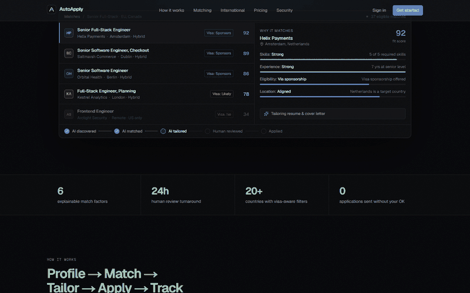

<br />
<br />

# AutoApply

### The career operating system for international talent.

AI finds and ranks the roles you can actually take: by skills, experience, work authorization, sponsorship and location.
It tailors every application, and a human specialist reviews it before anything is sent.

<br />


[**Quick start**](#quick-start) · [**How it works**](#how-it-works) · [**Architecture**](#architecture) · [**Security**](#security-model) · [**Project structure**](#project-structure)

</div>

<br />

## Why AutoApply

Most job boards optimise for volume. If you are looking for a job in another country, volume is the problem: most listings you see are roles you cannot legally take, at companies that will never sponsor you, and mass-applying burns your reputation with recruiters.

AutoApply flips the model.

| | Typical job board | AutoApply |
|---|---|---|
| **Eligibility** | Your problem | A first-class filter on every role |
| **Match score** | A black-box percentage | Six weighted factors, each with a written reason |
| **Applications** | Spray and pray | Tailored per role, approved by you |
| **Quality control** | None | A human specialist reviews before submission |
| **Tracking** | A spreadsheet | A board with notes, next steps and full history |

<br />

## How it works

**Profile → Match → Tailor → Apply → Track**


Every application moves through the same visible pipeline, so you always know who did what:

> **AI discovered → AI matched → AI tailored → Human reviewed → Applied**

<br />

### 1. A profile built for crossing borders

Upload a resume and the skills, headline and experience are extracted for you. Then you tell AutoApply what matters: where you can already work, whether you need sponsorship, where you would relocate, and what you need to earn.

<div align="center">
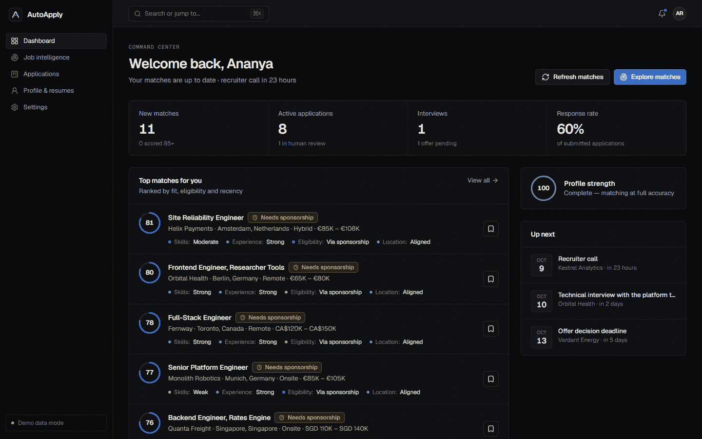
<br /><sub>The command centre: matches, applications, interviews, tasks and recent activity in one place.</sub>
</div>

<br />

### 2. Matches that explain themselves

Every role is scored on six factors. Each one returns a rating **and a sentence you can read**.

| Factor | Weight | What it looks at |
|---|---:|---|
| Skills | 32% | Required skills matched, plus partial credit for related ones (e.g. Vue ↔ React) |
| Experience | 20% | Years and seniority against the role |
| Eligibility | 20% | Can you work there today, or only with sponsorship? |
| Location | 12% | Home country, target countries, relocation, remote eligibility |
| Sponsorship | 8% | Listing language and the employer's sponsorship history |
| Preferences | 8% | Preferred roles and your salary floor |

A role you are legally blocked from is capped at a low score no matter how good the skills are.

<div align="center">
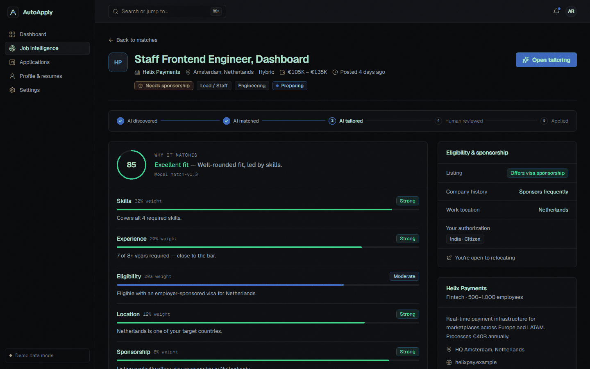
<br /><sub>Why a role matches: each factor shows its weight, rating and reason, with eligibility and sponsorship context alongside.</sub>
</div>

<br />

<div align="center">
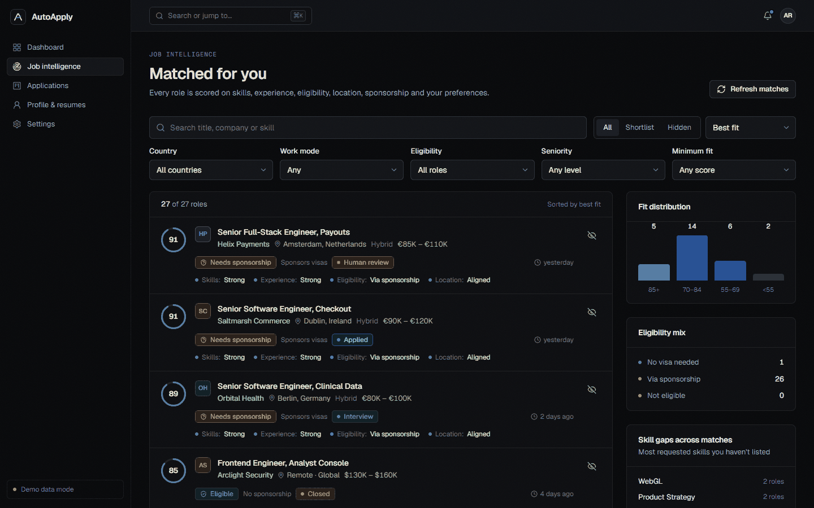
<br /><sub>Job intelligence: filters live in the URL, with fit distribution, eligibility mix and skill gaps across your matches.</sub>
</div>

<br />

### 3. Tailoring where you stay in control

AutoApply drafts a role-specific summary, rewrites resume bullets, writes a cover letter and shows a skill-gap table. **Nothing is applied until you accept or reject each suggestion**, and it never invents employers, titles or numbers.

<div align="center">
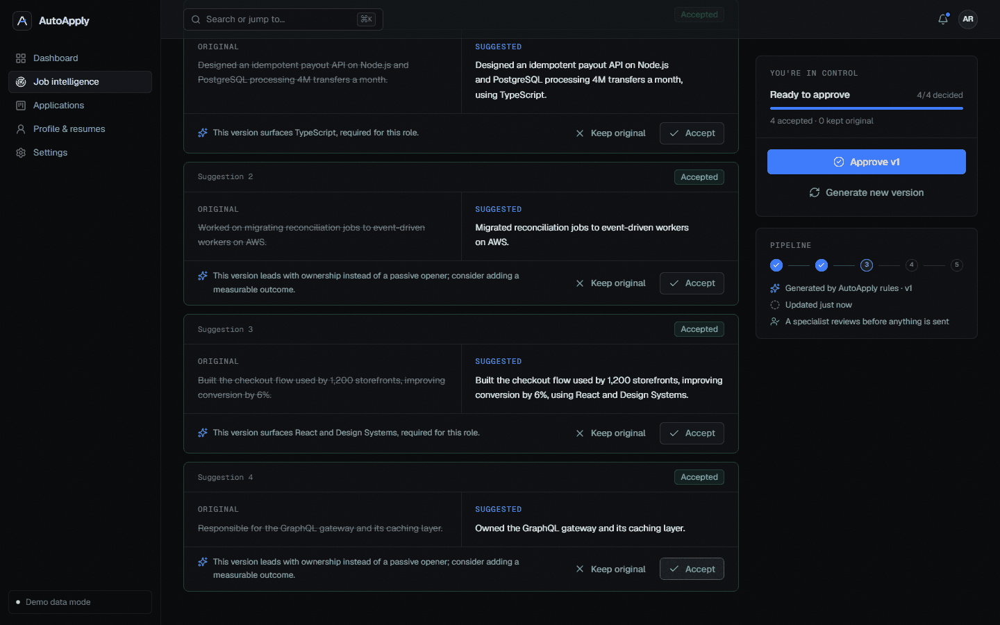
<br /><sub>Original versus suggested, with the reason for every change. Approve the version, then request human review.</sub>
</div>

<br />

### 4. Humans in the loop

Approved applications enter a review queue with a 24-hour SLA. A specialist claims one, works through a checklist (authorization, accuracy, cover letter, requirements, portal details), then approves or requests changes. Only then is it submitted.

<div align="center">
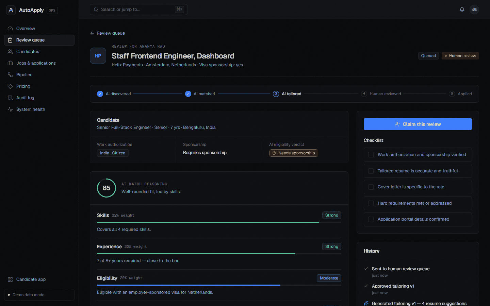
<br /><sub>The specialist's view: candidate eligibility, AI reasoning, tailored materials and the checklist.</sub>
</div>

<br />

### 5. Track everything

<div align="center">
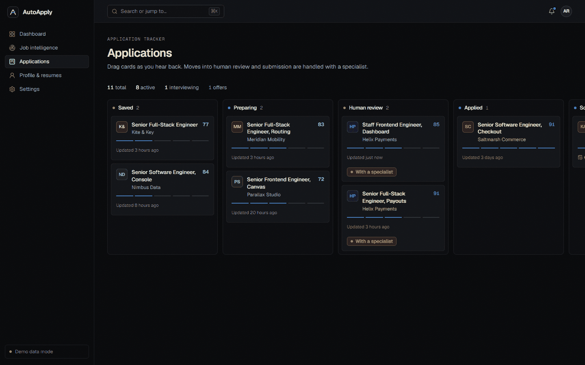
<br /><sub>Saved → Preparing → Human review → Applied → Screening → Interview → Offer → Closed. Drag cards, or use the Move menu.</sub>
</div>

<br />

<div align="center">
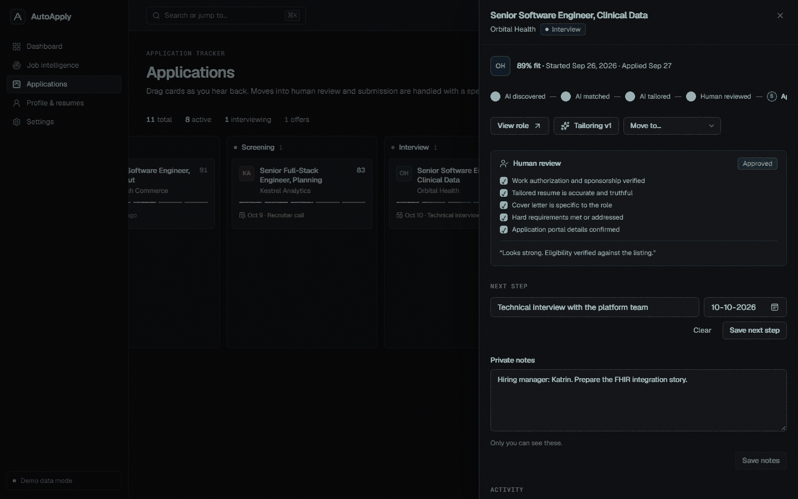
<br /><sub>Per-application drawer: review checklist, next step, private notes and a full activity timeline.</sub>
</div>

<br />

### Designed for phones too

The mobile experience is designed on its own terms: a bottom tab bar, one status column at a time on the tracker, and bottom-sheet filters.

<div align="center">
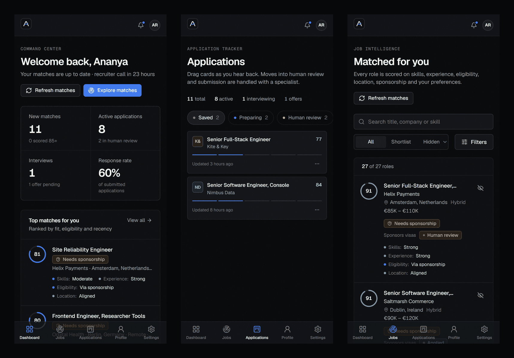
</div>

<br />

## The operations console

Staff get their own console: review queue, candidates, jobs and applications, the ingestion pipeline, an audit log, system health, and **pricing that is stored in the database**, so plans can be edited without a deploy.

<div align="center">
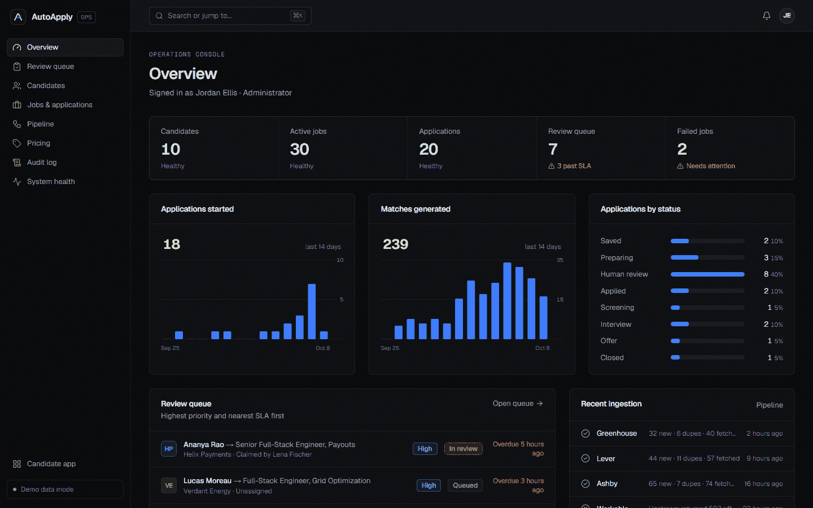
<br /><sub>Live KPIs, 14-day activity, status distribution, SLA alerts and failed jobs.</sub>
</div>

<br />

<div align="center">
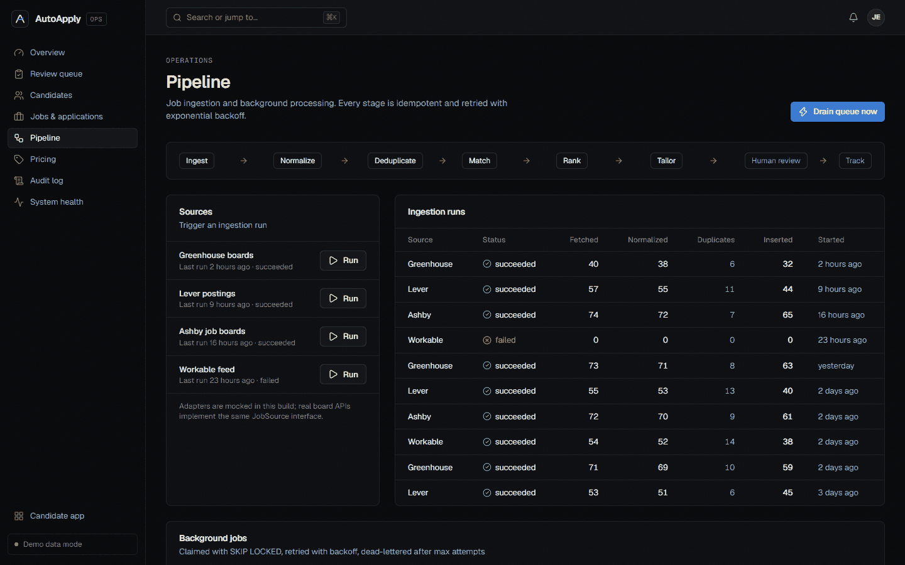
<br /><sub>Trigger ingestion, watch runs, and retry or inspect background jobs.</sub>
</div>

<br />

## Architecture

### System overview

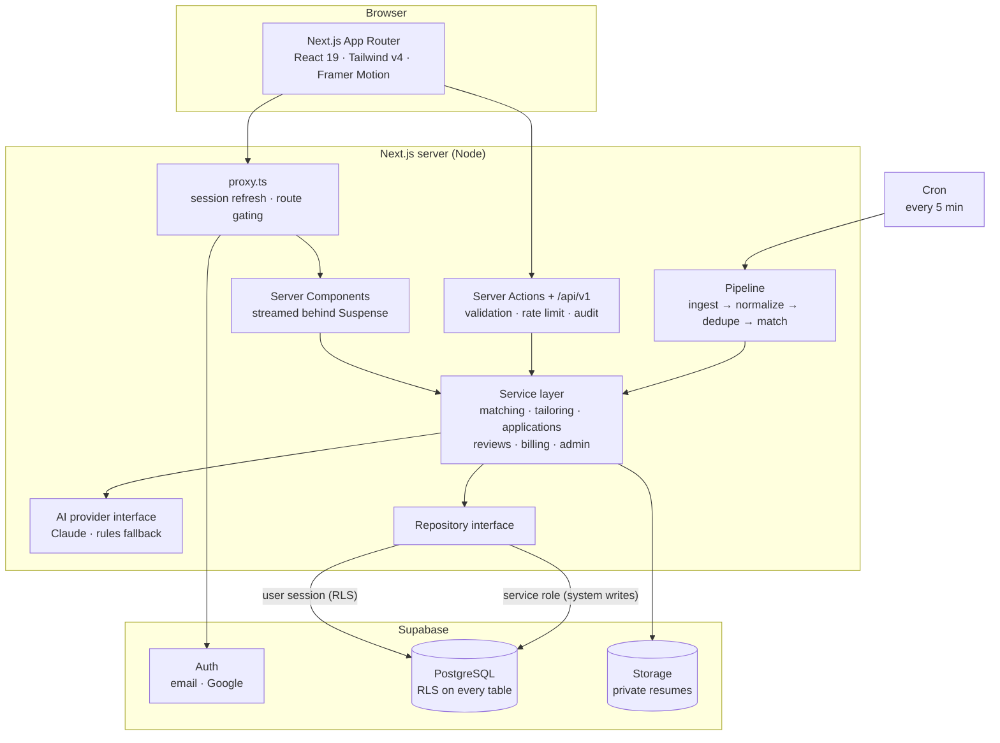

The data layer sits behind a single `Repository` interface with two implementations: **Supabase** (production) and an **in-memory seeded store** (demo mode). Services never know which one they are talking to, which is why the whole product runs with zero setup.

### The job pipeline

Everything between a posting appearing on a job board and a ranked match on a candidate's screen is asynchronous, idempotent and retried.

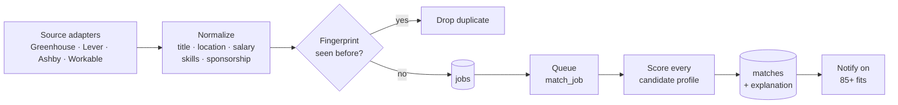

| Concern | How it is handled |
|---|---|
| Duplicates | A stable fingerprint of company, normalised title and country, so cross-posted roles collapse into one |
| Bad input | Malformed postings are rejected individually; one bad row never fails a run |
| Retries | Exponential backoff with jitter, then a dead-letter state after the max attempts |
| Idempotency | Every job carries a key, and enqueueing the same key twice creates one job |
| Concurrency | `FOR UPDATE SKIP LOCKED` lets many workers drain the queue without double-processing |
| Swapping sources | Each source implements one `JobSource` interface; the mock boards here are drop-in replaceable |

### Swappable AI

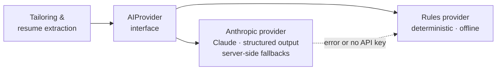

Product code never imports a model SDK directly. Claude output is validated against a Zod schema, and if the provider fails or no key is configured, the deterministic provider takes over so a candidate's workflow is never blocked.

### Application lifecycle

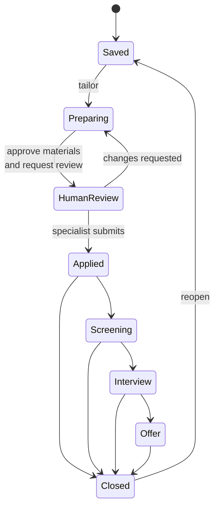

Candidates can move cards along allowed transitions. Entering human review requires an approved tailored document, and leaving it for *Applied* is something only a specialist can do.

### Data model

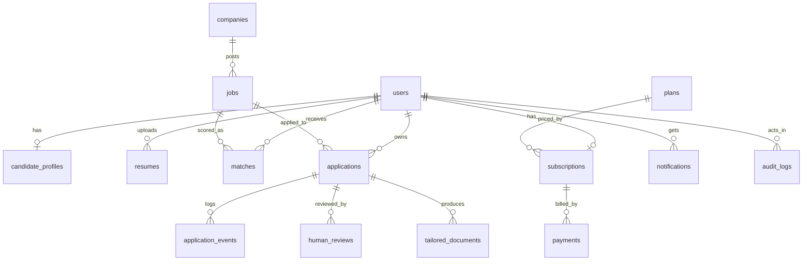

Plus `background_jobs`, `ingestion_runs`, `idempotency_keys` and `rate_limits` for the pipeline. See [`supabase/migrations`](supabase/migrations).

<br />

## Security model

| Layer | What protects it |
|---|---|
| **Row Level Security** | Enabled on every table. Candidates see only their own rows; staff can read operational data. |
| **Column privileges** | A signed-in user cannot change their own `role` or `email`, only an allow-listed set of columns. |
| **System-authored rows** | Matches, AI events, audit logs and queue jobs are written server-side with the service role, never by a browser session. |
| **Storage** | Private bucket, objects namespaced `<user-id>/…`, short-lived signed URLs, and file type checked by **magic bytes** rather than the client's claim. |
| **Authorization** | Re-checked in a Data Access Layer on every page, action and route. The proxy is only an optimistic gate. |
| **Abuse** | Postgres-backed fixed-window rate limits, safe-redirect validation, and idempotency keys on mutating API calls. |
| **Observability** | Structured JSON logs with secret redaction, and an append-only audit trail of who did what. |
| **Secrets** | Service credentials never reach the client; production fails closed without a session secret. |

These are not just claims: the test suite boots the real migrations in an in-process Postgres and asserts them (see [Testing](#testing)).

<br />

## Quick start

> No accounts, keys or database needed. The app runs on realistic seeded data out of the box.

```bash
git clone https://github.com/rohzyy/AutoApply.git
cd AutoApply
npm install
npm run dev
```

Open <http://localhost:3000>, go to **Sign in**, and pick **Candidate** or **Operations** under *Explore with demo data*.

Demo mode keeps data in memory, so it resets whenever the server restarts.

<br />

## Run it for real (Supabase)

1. **Create a Supabase project.** Enable the Email provider, and Google if you want OAuth.
2. **Apply the migrations** in [`supabase/migrations`](supabase/migrations), in order (`supabase db push` or the SQL editor).
3. **Configure the environment.**
   ```bash
   cp .env.example .env.local
   ```
   Fill in `NEXT_PUBLIC_SUPABASE_URL`, `NEXT_PUBLIC_SUPABASE_ANON_KEY`, `SUPABASE_SERVICE_ROLE_KEY`, `CRON_SECRET`, and optionally `ANTHROPIC_API_KEY`.
4. **Load the demo dataset** (optional):
   ```bash
   npm run seed
   ```
5. **Deploy.** [`vercel.json`](vercel.json) schedules the background worker every 5 minutes.

| Variable | Required | Purpose |
|---|:---:|---|
| `NEXT_PUBLIC_SUPABASE_URL` / `NEXT_PUBLIC_SUPABASE_ANON_KEY` | for production mode | Supabase project |
| `SUPABASE_SERVICE_ROLE_KEY` | for production mode | Server-only; system writes |
| `ANTHROPIC_API_KEY` | optional | Enables Claude; otherwise the rules provider is used |
| `AI_MODEL` | optional | Defaults to `claude-opus-5-5` |
| `CRON_SECRET` | production | Authorises `/api/cron/worker` |
| `SESSION_SECRET` | demo in production | Signs demo-mode sessions |
| `ADMIN_EMAILS` | optional | Comma-separated emails promoted to admin on sign-in |
| `SEED_DEMO_PASSWORD` | for `npm run seed` | Password for seeded accounts |

<br />

## Testing

```bash
npm test          # unit tests + database / RLS tests
npm run typecheck
npm run lint
```

- **Matching engine:** sponsorship rules, blocked-eligibility capping, transferable skills, ranking.
- **Ingestion:** title cleaning, location and salary parsing, sponsorship detection, fingerprints.
- **Sessions:** tamper, expiry and fail-closed behaviour.
- **Database:** every migration is applied to an in-process Postgres ([PGlite](https://pglite.dev)), then the tests prove that candidates cannot read each other's rows, cannot promote themselves to admin, cannot forge AI-authored events, cannot write outside their storage folder, and that the queue claims each job exactly once.

<br />

## API

| Endpoint | Description |
|---|---|
| `GET /api/v1/matches` | The signed-in candidate's ranked matches with per-factor explanations. Accepts the same filters as the UI. |
| `GET /api/v1/applications` | The candidate's tracker. |
| `POST /api/v1/applications` | Save a job. Requires an `Idempotency-Key` header; replays return the original response. |
| `GET /api/resumes/:id` | Owner-only resume download. |
| `GET /api/cron/worker` | Bearer-token protected; enqueues hourly ingestion and drains due jobs. |
| `GET /api/health` | Liveness probe. |

<br />

## Project structure

```
src/
├─ app/                    Routes
│  ├─ (marketing)/         Landing page, pricing
│  ├─ (auth)/              Sign in, sign up
│  ├─ (app)/               Dashboard, jobs, applications, profile, settings
│  ├─ admin/               Operations console
│  ├─ actions/             Server Actions (typed results, rate limited, audited)
│  └─ api/                 REST routes, cron worker, health
├─ components/
│  ├─ ui/                  Design system primitives
│  ├─ app/ · admin/        Product components
│  └─ marketing/           Landing page and hero demo
└─ lib/
   ├─ data/                Repository interface: Supabase + in-memory
   ├─ services/            Matching, tailoring, applications, reviews, billing, admin
   ├─ pipeline/            Sources, normalization, ingestion, queue, worker
   ├─ ai/                  Provider interface: Claude + rules
   ├─ auth/ · infra/       Sessions, errors, rate limiting, logging, retries
   └─ seed/                Realistic fictional companies, jobs and people
supabase/
├─ migrations/             Schema, RLS and column grants, default plans
└─ tests/                  Database tests (real migrations, in-process Postgres)
```

<br />

## Design principles

- **Typography and hierarchy first.** Near-black surfaces, a single electric-blue accent, hairlines instead of floating cards.
- **Motion communicates state.** Short, purposeful transitions; everything respects `prefers-reduced-motion`.
- **Every action has four states:** loading, success, failure and empty.
- **Accessible by default.** Visible focus, keyboard navigation, labelled controls, tables for chart data, and sensible contrast.
- **The human stays in charge.** AI proposes. You decide. A specialist verifies.

<br />

---

<div align="center">

### Made with ❤️ by **Team Synapse**

<sub>AutoApply is a capstone project. All companies, jobs and people shown are fictional.</sub>

</div>
